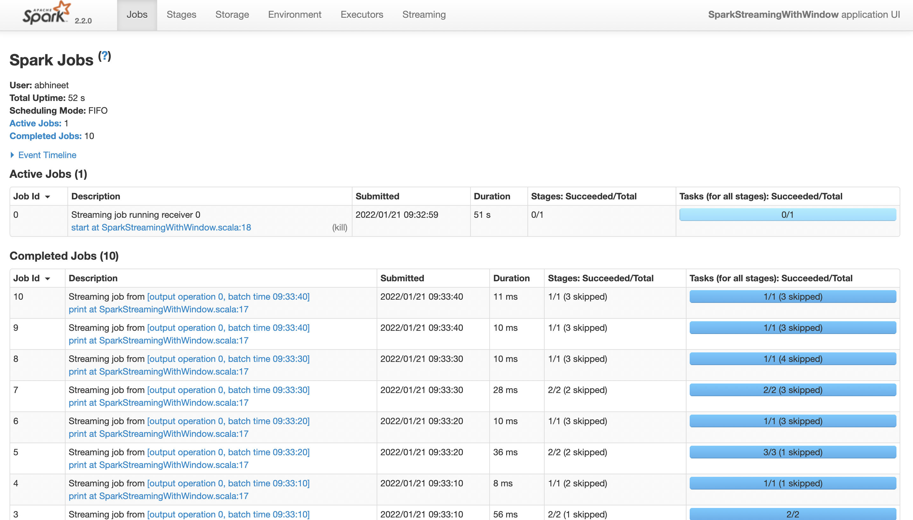
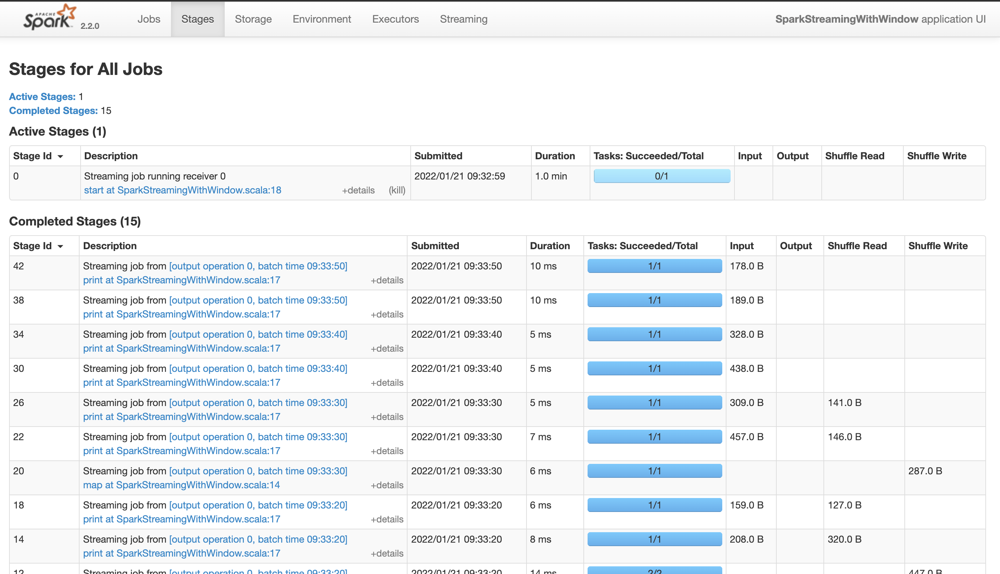
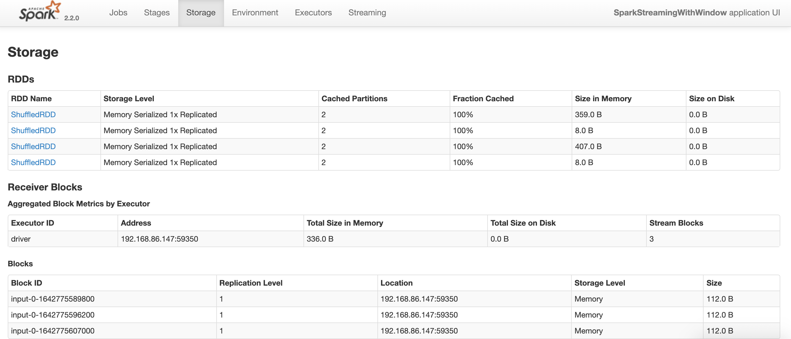
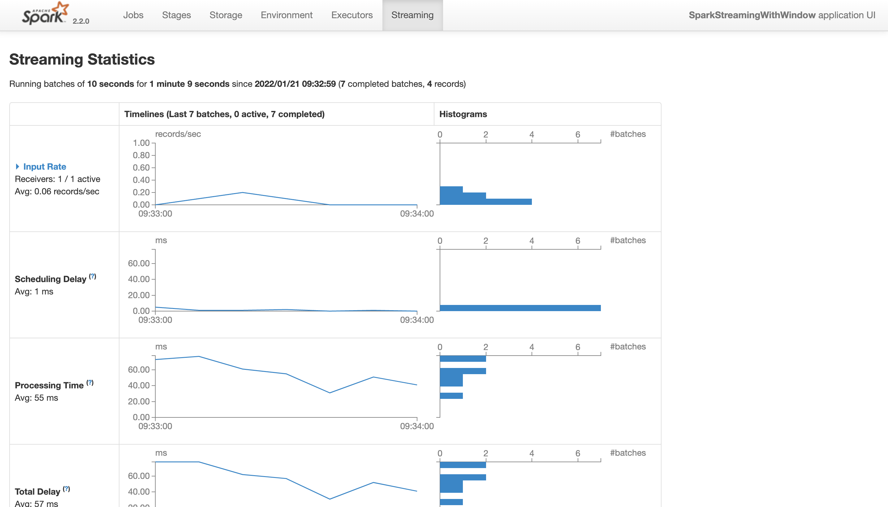

A **Spark streaming** application that counts the number of words from the input stream.

Uses **windowing** with memory storage to compute on previously received data.

Uses **checkpointing** for fault tolerance.

## Spark streaming
1. Run `main.scala.org.example.SparkStreaming` class.
2. Use `netcat` to communicate text streams to Spark.
3. In a separate terminal, enter `nc -l 2222`. This will open a prompt where you can enter input text.
4. You will see the word counts being printed in the `SparkStreaming` output every 10 seconds. 
These counts are based on the data from the last `10` seconds.
5. The Spark UI can be seen at `http://192.168.86.147:4040/`.

## Spark streaming with window
1. Run `main.scala.org.example.SparkStreamingWithWindow` class.
2. Use `netcat` to communicate text streams to Spark.
3. In a separate terminal, enter `nc -l 2222`. This will open a prompt where you can enter input text.
4. You will see the word counts being printed in the `SparkStreamingWithWindow` output every 10 seconds.
   These counts are based on the data from the last `30` seconds.
5. The Spark UI can be seen at `http://192.168.86.147:4040/`.

## Spark UI
### Spark Jobs

### Spark Stages

### Spark Storage (only with windowing)

### Spark Streaming
